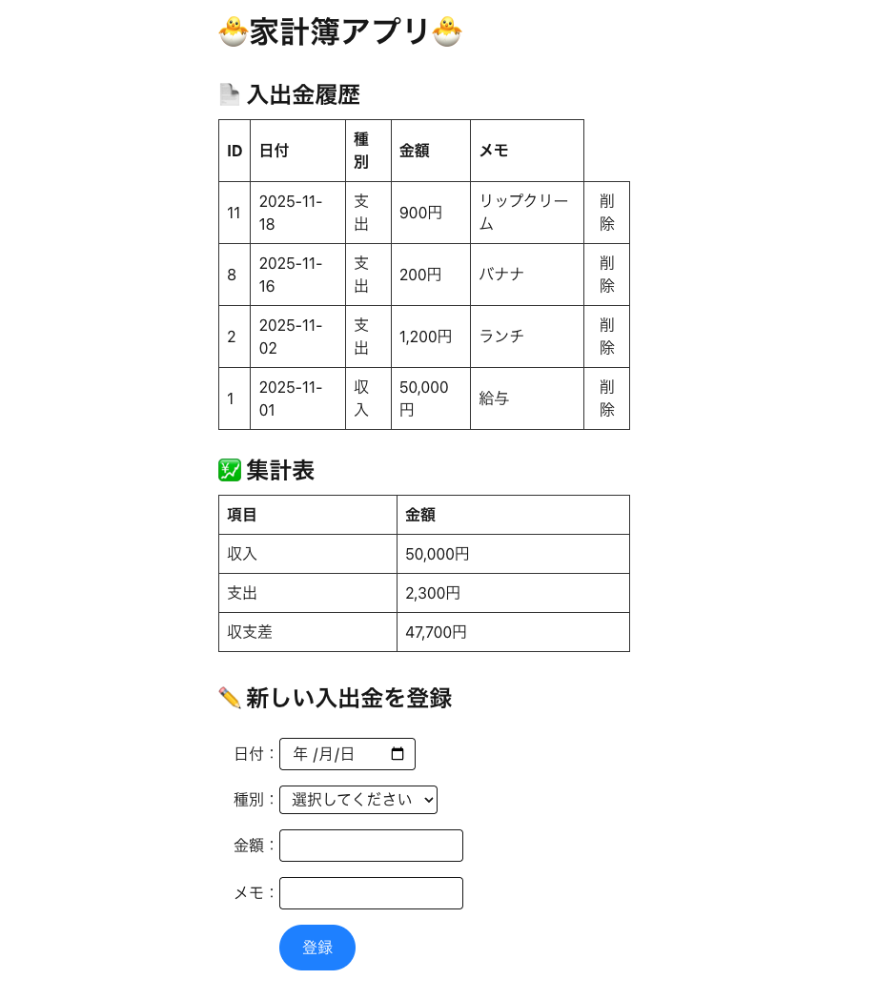

# 家計簿アプリ（household-frontend）

## 概要

このアプリは、日々の入出金を管理し、  
一覧表示・集計（収入 / 支出 / 収支差）を確認できる家計簿アプリです。

バックエンド（Express + Prisma + MySQL）と連携しています。

## デモ画面



## 使用技術

- Next.js 16（App Router）
- React 19
- TypeScript
- SWR（データ取得・再検証）
- Fetch API
- Tailwind CSS

## 主な機能

- 入出金一覧の表示
- 新規入出金の登録
- 入出金の削除
- 収入・支出・収支差の集計表示

## バックエンドとの連携

- APIエンドポイント例
  - GET /transactions
  - POST /transactions
  - DELETE /transactions/:id
  - GET /summary

## 起動方法

```bash
npm install
npm run dev
```

バックエンドを先に起動してから
http://localhost:3000 にアクセスしてください。
